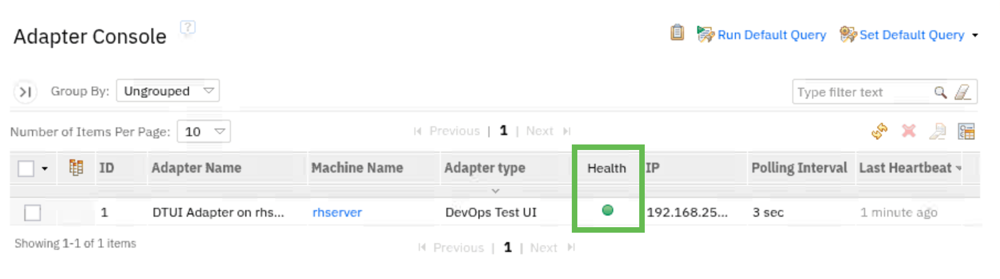

# Connect DevOps Test with Engineering Test Management (ETM) to accelerate the test cycle by automating test execution.

## About the integrated IBM Test Management / Test Automation Solution

**IBM Engineering Test Management Overview**

| **Product Name** | 
**Description**
 | **Additional Information** |
|:-------------:|:------------- |:------------- |
| Engineering Test Management | ETM is a collaborative, web-based tool for planning, constructing, managing, and executing tests throughout the development lifecycle for test teams of all sizes. To learn more about Engineering Test Management | [Overview](https://www.ibm.com/docs/en/engineering-lifecycle-management-suite/test-management/7.1.0?topic=overview-engineering-test-management) |

**IBM DevOps Test Automation Overview**

| **Product Name** | 
**Description**
 | **Additional Information** |
|:-------------:|:------------- |:------------- |
| DevOps Test Hub | Test Hub, a web-based continuous testing platform, enables test teams to run a breadth of tests that includes API, functional, and performance tests as well as bringing together test data, test environments, and test runs and reports into a single, web-based browser for testers and non-testers. | [Overview](https://www.ibm.com/docs/en/devops-test-hub/11.0.6?topic=guide-introduction-devops-test-hub) |
| DevOps Test UI | Test UI is an object-oriented automated testing tool that tests a wide range of desktop, Web, and mobile applications. Test UI provides automated testing capabilities for functional, regression, GUI, and data-driven testing. | [Overview](https://www.ibm.com/docs/en/SSBLQQ_11.0.6/docs/topics/IntrotoRobotJ.html) |
| DevOps Test Integrations and APIs | Test Integrations and APIs is an integration testing and virtualization tool that includes capabilities to automate and run tests earlier and more often to find problems sooner in the development cycle.| [Overview](https://www.ibm.com/docs/en/devops-test-workbench/11.0.6?topic=started-overview-devops-test-integrations-apis) |
| DevOps Test Performance | Test Performance is a scripting-free environment for automating load and scalability testing of web, ERP, and server-based software applications. Test Performance provides rich and customizable reporting to help you identify the presence and cause of system bottlenecks. It captures the network traffic that is rendered when the application under test interacts with a server. This network traffic is then emulated on multiple virtual users while you play back the test. | [Overview](https://www.ibm.com/docs/en/devops-test-workbench/11.0.6?topic=started-devops-test-performance-overview) |

## Why integrate IBM DevOps Test Automation with IBM Engineering Test Management
While test automation is not a "silver bullet" replacement for all manual testing activities and is often misused as a means or reason to reduce the size of test teams, test automation does provide organizations with many benefits, including:

| **Value Proposition** | **Explanation** |
|:-------------:|:------------- |
| Saving organizations time and money | While not all tests should be automated or can be automated, automated testing reduces the cost of testing by reducing the expensive manual effort executing test scripts which are candidates for test automation. |
| Helping test teams increase test coverage | Freeing testers from having to execute test scripts manually by following a series of documented test steps allows them to focus on improving the overall test effort - identify missing test cases, focus on exploratory testing, improving test practices eliminating waste, etc... |
| Improving testing accuracy | Let's face it, people make mistakes. Automated testing is software designed to repeatedly and consistently execute a series of steps against the application under test over and over to verify functions and features. |
| Accelerating feeback on software quality | As automated testing is faster, can be run as part of a deployment process, and consistently executes to verify software quality, the results of those test executions can be immediately shared directly back to the development team providing continuous feedback on software quality. |
| Improving team morale | By allowing Testers to focus on improving the testing practice and providing Developers accelerated feedback on the sofware they are developing can only lead to improved morale. |

## About the learning environment
**ETM Setup:**
In order to share details and experience hands on learning with how to configure and exercise the connection between ETM and DevOps Test UI, the JKE Banking (Quality Management) project was added to ELM as part of installing the Money that Matters sample application. In addition, to enable the Test Hub adapter in ETM, the DevOps Test Hub adapter files have been downloaded and installed ETM. For details on how to install the DevOps Test Hub adapter files in ETM, refer to the instructions available at the following URL : [https://www.ibm.com/docs/en/devops-test-hub/11.0.6?topic=management-adding-adapter-files-engineering-test](https://www.ibm.com/docs/en/devops-test-hub/11.0.6?topic=management-adding-adapter-files-engineering-test)

**DevOps Test UI Setup:**
As the scope of this exercise is to share details on how to integrate DevOps Test with ETM and not provide details on how to record and modify an automated test script, a Test UI project has been already created and an automated test script recorded. Details of the test script are a follows: 
1. Launches the application under test in a browser. 
2. Modifies several field on the UI to submit a donation to the charity of choosing. 
3. Posts the donation. 
4. Verifies the donation has been successfully submited. 
5. Browser closes/ test ends. 

**Application Under Test (AUT) Setup:**
The "JKE Banking - Donations" demo application being subjected to test automation is a simple html file containing javascript. It is deployed as a docker container running on an nginx server to host the index.html file on port 81 (http://127.0.0.1:81) and starts up during boot of the RHEL OS.

**Chrome/Firefox Browser Setup:**
Both browser applications have bookmarks available to conveniently access the Workbook, the ELM instance, and the JKE Banking - Donations demo application.

## About this workbook
The scope of this workbook is to share details on how engineering teams can connect automated test scripts (authored in one of the many DevOps Test solutions) with test cases (managed in Engineering Test Management) for the purpose of automating test execution and delivering feedback on software quality to developers faster. And while the demo guide will share details on how to configure all the different adapter options, this exercise will focus on the end to end story involving DevOps Test UI and ETM as, once an adapter is configured, the process of adding a test script to an ETM test case is the same. 

What this exercise does not cover is how to author automated tests in any of the DevOps Test Automation solutions or how to perform test management in ETM.

If you are interested in learning more about specific test management and/or test automation capabilities offered by IBM Software:  
To learn more about test management capabilities offered by IBM visit [IBM's ETM documentation webpage.](https://www.ibm.com/docs/en/engineering-lifecycle-management-suite/test-management/7.1.0?topic=overview-engineering-test-management).  
To learn more about test automation capabilities offered by IBM visit [IBM's DevOps Test documentation webpage](https://www.ibm.com/docs/en/devops-test-workbench/11.0.6).  

**In this workbook, you will learn how to:** 
1. Configure Test Adapters creating a communication channel between ETM and DevOps Test. 
2. Add a test script to an ETM test case and link to the DevOps Test script for test execution. 
3. Execute the test from ETM by running the test case and observing the DevOps Test autoamted test playback against the application under test. 
4. Review the test execution verdict and result file(s) returned to ETM from DevOps Test solution. 

### 1. Configure Test Adapters creating a communication channel between ETM AND DevOps Test ###
There are 3 adapters available to execute automated tests linked to test cases managed in ETM. Which adapter to use depends on the test automation solution the automated test scripts were authored with.

**1-1 Configuring the DevOps Test Hub adapter**

The Test Hub adapter is used to create a connection between DevOps Test Hub and ETM. As this learning environment does not have a Test Hub instance installed and running, **this section is informational** sharing specifics on how to configure the adapter.

| **Step** | 
**Details**
  | **Additional Information** |
|:-------------:|:------------- |:------------- |
| 1 | Log in to Test Hub. |  |
| 2 | Open the Test Project (e.g. JKEBanking) by clicking on the tile. |  |
| 3 | Click **Manage > Integration** from the left-hand navigation bar. |  |
| 4 | On the Integration page, click **Add IBM ETM Adapter** within the IBM Engineering Test Management (ETM) section. |  |
| 5 | Enter the **ETM server URL**, **user name**, and **password**. For the purpose of this exercise the following values were used:  **Server URL:** https://ibmjazz.net:9443 **Username:** sysadmin **Password:** Passw0rd |  |
| 6 | Click **Validate**. |  |
| **NOTE:** | The Validate action connects to the ETM instances retrieving the available project areas to populate the Project area picklist. |  |
| 7 | Select **JKE Banking (Quality Management)** from the Project area list. |  |
| 8 | Provide a meaningful name for the adapter to be displayed in ETM on the adapter console. |  |
| 9 | Click **Save** when done.|  |

**1-2 Configuring the Test UI adapter**

The Test UI adapter is used to create a connection between the **Functional** testing perspective in DevOps Test UI (formerly Rational Functional Tester) with ETM. While you will not be executing a functional test script, this section of the workbook shares details on how to configure the adapter, start the adapter, and confirm that the adapter is available in ETM.

| **Step** | 
**Details**
  | **Additional Information** |
|:-------------:|:------------- |:------------- |
| 1 | Open a terminal session.  |  |
| 2 | Navigate to the following folder within the DevOpsTest installation location:  *TestUI installation directory*/FunctionalTester/RQMAdapter/   For this exercise, the installation folder is "/opt/IBM/DevOpsTest"  **/cd /opt/IBM/DevOpsTest/FunctionalTester/RQMAdapter** |  |
| 3 | As the superuser, execute the following command:   **sudo ./configureadapter**  *sudo password is "Passw0rd" (Passw+zero+rd)* |  |
| 4 | In the DevOpsTest UI Adapter user interface, enter the appropriate information for your ETM installation. For the purposes of this exercise, the following was used to establish a connection with ETM.  **Server URL:** https://ibmjazz.net:9443/qm **Authentication Type:** Username and Password **User ID:** sysadmin **Password:** Passw0rd **Project area:**  JKEBanking (Quality Management) - selected from the picklist **Adapter Name:** DTUI Adapter on rhserver |  |
| **NOTE:** | The Project area picklist is automatically populated upon supplying the URL, User ID, and Password values.|  |
| 5 | Click **Start Adapter**. |  |
| 6 | Click the **Adapter Console** tab to confirm a connection was made to ETM. |  |
| 7 | Launch a Browser and navigate to the JKE Banking (Quality Management) project in ETM.  **User ID:** sysadmin **Password:** passw0rd |  |
| 8 | From the JKE Banking (Quality Management) project area, click **Execution** and select **Adaptor Console** from the list of options |  |
| 9 | Confirm that the **DTUI Adapter on rhserver** is listed and showing as **Healthy** |  |
| 10 | Return to the DevOps Test UI Adapter window on the Desktop, click **Stop adapter**, and close the adapter and terminal windows. |  |
| **NOTE:** | The test adapter configuration settings persist. Meaning, to start the adapter in the future, navigate to to the adapter installation folder and run **sudo ./startadater** instead of configure adapter.|  |

**1-3 Configuring the Test Workbench adapter**

The Test Workbench adapter is used to create a connection between the **Test UI** and/or the **Performance** testing perspectives in DevOps Test UI with ETM. This section of the workbook shares details on how to configure the adapter, start the adapter, and confirm that the adapter is available in ETM.

| **Step** | 
**Details**
  | **Additional Information** |
|:-------------:|:------------- |:------------- |
| 1 | From the RHEL desktop, click **Applications > DevOps Test > DevOps Test UI** to launch the application. |  |

### 2. Add a test script to an ETM test case and link to the DevOps Test script for test execution ###

| **Step** | 
**Details**
  | **Additional Information** |
|:-------------:|:------------- |:------------- |
| 1 | blah | image link |

### 3. Execute the test by ETM running the test case and observing the DevOps Test autoamted test playback ###

| **Step** | 
**Details**
  | **Additional Information** |
|:-------------:|:------------- |:------------- |
| 1 | blah | image link |

### 4. Review the test execution verdict and result file returned to ETM from DevOps Test solution ###

| **Step** | 
**Details**
  | **Additional Information** |
|:-------------:|:------------- |:------------- |
| 1 | blah | image link |

| Software Installed for Enablement Exercises | Software Version |
|:---- |:----:|
| DevOps Test UI | Version 2025.06 (11.0.5) |
| DevOps Test Performance | Version 2025.06 (11.0.5) |
| Engineering Lifecycle Management | v7.1 SR1 |
